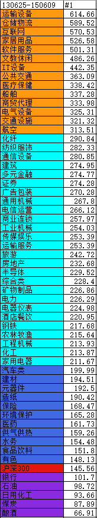
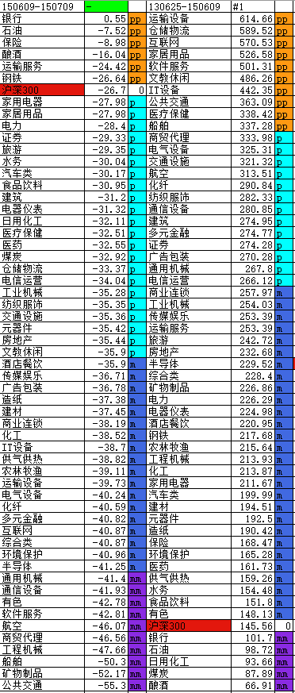

[前戏-沪深300-牛市-20130625:20150609](#0)

[波段1总览-20150609:20150826](#1)
[波段2总览-20150826:20151223](#2)
[波段3总览-20151223:20160229](#3)

[波段1-大盘闪崩下跌-20150609-20150709](#11)


<h1 id="0">前戏-沪深300-牛市-20130625:20150609</h1>

> 先列出这段牛市，板块涨幅情况



1. 强势板块：涨幅 超300%，主题：互联网，物流，软件。
2. 中势板块：涨幅 在200% - 300% 之间， 主题：纺织，证券，房地产，旅游，通信和建筑
3. 偏弱板块：涨幅小于200%， 主题：汽车，建材，保险，医药和食品
4. 弱势板块：低于大盘，主题：银行，石油，煤炭，酿酒。

```
大环境，配资
``` 

<h1 id="1">波段1总览-20150609:20150826</h1>

> 大盘迅速下跌探底

> 迅速下跌的板块
   1. 前期强势板块：
        > 运输设备，互联网，软件服务，公共交通，医疗保健，船舶
   2. 前期中势板块：
        > 证券，矿物制品, 工程机械，电气设备
   3. 前期弱势板块：
        > 有色，煤炭
> 抗跌的板块
   1. 前期强势板块：
        > 仓储物流，家居用品，文教娱乐
   2. 前期中势板块：
        > 电力，酒店餐饮
   3. 前期弱势板块：
        > 银行，酿酒，食品饮料，医药
> 中庸的板块
   1. 前期强势板块：
        > IT设备，
   2. 前期中势板块：
        > 商贸代理，交通设施，航空，环境保护，保险
   3. 前期弱势板块：
        > 日用化工，石油，水务，供气供热

> 波段1总结

```
波段0强势股领跌，波段0偏弱的板块跟随下跌确实。抗跌板块集中在银行，酿酒，医药，食品, 其中银行和酿酒在波段0中涨幅倒数。 
```


<h1 id="2">波段2总览-20150826:20151223</h1>

> 大盘反弹

> 强势反弹板块

    > 矿物制品，互联网，公共交通，证券，日用化工，软件服务，旅游，元器件，房地产
> 弱势板块

    > 航空，商贸代理，运输服务，煤炭，交通设施，电力，石油，钢铁，仓储物流，船舶

> 波段2总结

```
此次行情反弹，
强势反弹的板块集中于波段1超跌的板块，和波段0涨幅偏弱的板块（波段0涨幅偏弱的板块，在波段1中也属于偏弱的板块）。
在波段1中抗跌的板块在反弹行情中，普遍涨幅偏弱
```

<h1 id="3">波段3总览-20151223:20160229</h1>

> 反弹结束，大盘新低

> 抗跌板块

    > 煤炭，石油，银行，酿酒，有色，化纤，汽车类，钢铁，农林牧渔
> 下跌板块

    > 通用机械，广告包装，仓储物流，软件服务，运输服务，证券，多元金融，传媒娱乐，船舶，矿物制品

> 波段3总结

```
大盘新低，下跌幅度大的板块  （强弱为波段0中的定义）
1. 波段1 没跌的强势板块
2. 波段2 强力反弹的偏弱势板块
```


<h1 id="11">波段1-大盘闪崩下跌-20150609-20150709</h1>

1. 板块跌幅情况，对比牛市涨幅。



> 上一个波段为牛市，时间周期130625-150609，当前波段闪崩

> 强势板块描述

1. 银行，mm->pp 创新高，抗跌。
2. 石油，mm->pp，抗跌。
3. 保险，m->pp，抗跌，与石油走势相似
4. 酿酒，mm->pp, 牛市倒数第一，创新高，抗跌性不如前3个板块。

> 中势板块描述

1. 运输服务，牛市中势，创新高后快速下跌，涨跌滞后
2. 钢铁，牛市中势，创新高后快速下跌
3. 家用电器，牛市中势，创新高后快速下跌
4. 家居用品，牛市强势，创新高后快速下跌
5. 电力，牛市中势，创新高后快速下跌
6. 证券，牛市中势，快速下跌
7. 旅游，牛市中势，创新高后快速下跌

> 偏弱板块描述

1. 水务，牛市偏弱，

